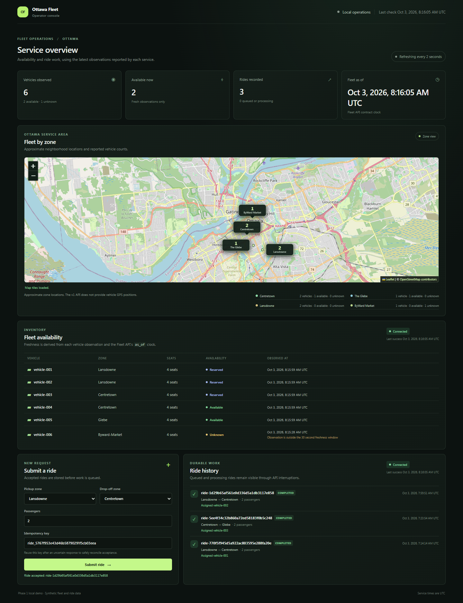
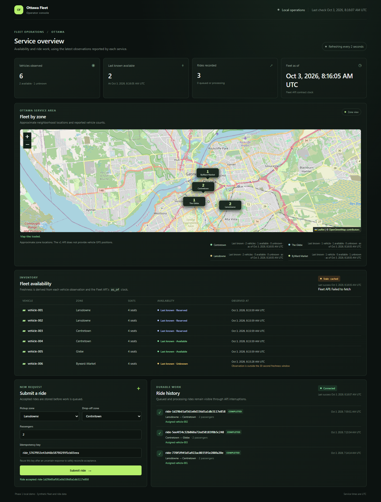

# Operator UI screenshots

These images contain synthetic fleet and ride data. They were captured on 2026-10-03 from the operator UI against native Go APIs/worker and PostgreSQL 15.19 in Docker. They show a completed ride and last-known data after a Fleet fetch failure. This is mixed-runtime evidence; it does not establish fresh Docker Compose acceptance.

The Ottawa basemap uses OpenStreetMap with attribution. Zone markers are approximate neighborhood locations, because the v1 API provides no vehicle GPS coordinates.

