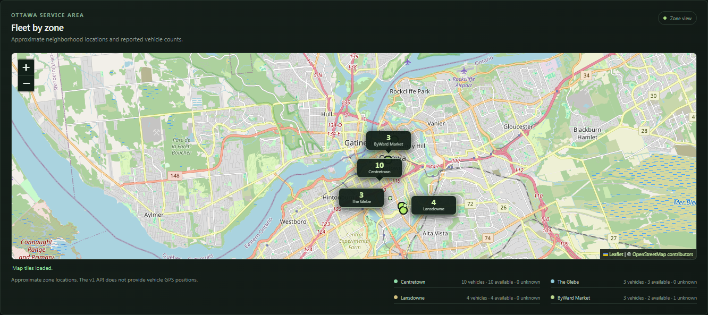
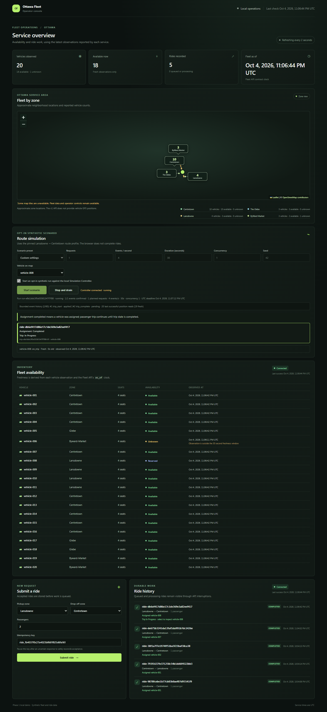
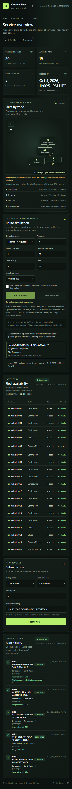

# Simulation acceptance

## Automated public API journey

Start a fresh, dedicated simulation Compose project by following the
[local development runbook](local-development.md#opt-in-route-simulation-profile).
After all services are ready, run:

```powershell
python tests/simulation_journey.py
```

The script uses the public loopback Fleet, Ride, and simulation-controller APIs.
It checks the pinned route and 20-vehicle fixture, idempotent exact replay,
conflict fencing, moving positions, completed trips, location-aware v1 reuse,
and Stop with drain. It persists runs and rides in the named project volume;
choose a new project name for a clean acceptance pass. Do not remove that volume
until the evidence has been inspected.

## Human operator acceptance

Complete these checks in the operator UI at `http://localhost:18088` while the
simulation profile is up. Record any failure with the run state and a concise
description. The captures below show the final reviewed UI with real services.

1. Enable simulation controls, start the pinned route, and confirm the run ID,
   state, event progress, route, and moving vehicle are visible.
2. Refresh the page during the run. Confirm it reloads the same active run and
   event history without submitting another Start request.
3. Restart only the controller during a moving trip:

   ```powershell
   docker compose --project-directory . -p $env:SIMULATION_PROJECT_NAME -f deploy/compose.yaml -f deploy/compose.simulation.yaml --profile simulation restart simulation-controller
   ```

   Confirm the UI reconnects, preserves the run and trip identity, and does not
   show duplicate events or a second trip start.
4. Observe a stale vehicle position. Confirm the stale state is visible and its
   marker stops interpolating from the old observation. A stale observation
   must not be presented as a current live position.
5. In browser developer tools, block requests to
   `https://tile.openstreetmap.org/*` and reload. Confirm the map reports that
   tiles are unavailable while fleet data and operator controls remain usable.
   Remove the block and confirm the tile status recovers.
6. Start another bounded run and choose **Stop and drain** while a trip is in
   progress. Confirm no new work is issued, the accepted trip's effects
   reconcile, and the terminal run shows zero incomplete events and trips.

The browser journey passed on the rebuilt local stack at 2026-10-04 23:06:52
UTC: refresh restored the same run and selected vehicle, exactly one Start POST
was sent, the backend completed the trip, and blocking external map tiles left
fleet data and controls usable. Selecting the deliberately stale vehicle-006
showed **Last known**, matching the API's stale observation without a live
movement segment. Unit checks separately cover freezing an aged moving segment.
The final 390-pixel mobile page fits its viewport, including long durable IDs.
Desktop and mobile captures intentionally demonstrate unavailable map tiles;
a separate normal-map check loaded 18 Ottawa tiles with attribution intact.







## Recorded API evidence

A local public-API acceptance run on 2026-10-04 completed 27 assertions with no
failures in 25.687 seconds. It observed two run records and four applied events
across the completed journey and the separate Stop-and-drain run. The completed
primary trip took 8.228467 seconds by Ride server timestamps; the Stop run also
drained its already accepted trip before its deadline. The evidence driver's
`trip_count` summary is 1 because it records only the timed primary trip. One
additional v1 Ride was accepted at the destination and completed assignment to
the arrived vehicle; its synthetic reservation was then released.

One resource sample saw six running containers with a combined reported memory
use of approximately 99.59 MiB. This is a single local sample and makes no
throughput or capacity claim.

The public CI journey also passed against a separate fresh Compose project on
2026-10-04. It observed four distinct moving positions, two applied events in
the normal run, exact reuse of vehicle-001 by a new v1 Ride, and a stopped drain
with zero incomplete outcomes. The physical fleet remained 20. CI repeats this
journey after the existing six-vehicle assignment regression in separate
projects and removes only those disposable CI resources.

## Stop semantics

Stop snapshots an immutable deadline and stops new demand submissions and trip
starts. The controller may keep replaying effects that were already issued and
reconciling accepted trips after that deadline. When the deadline arrives, the
run becomes terminal with an immutable snapshot of incomplete events, requests,
and trips. Later reconciliation may still update Fleet or Ride owner state, but
it cannot create new work or change the terminal run snapshot. A drain that
finishes before the deadline records zero incomplete events and trips.
